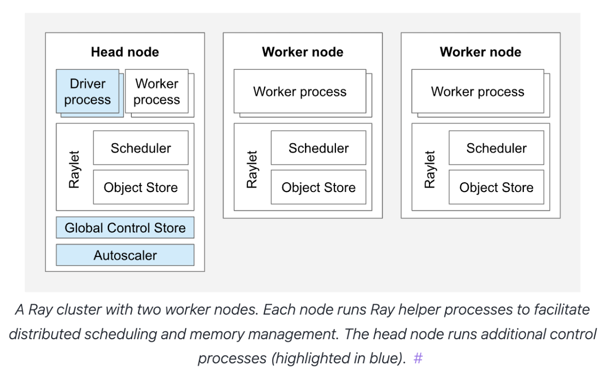
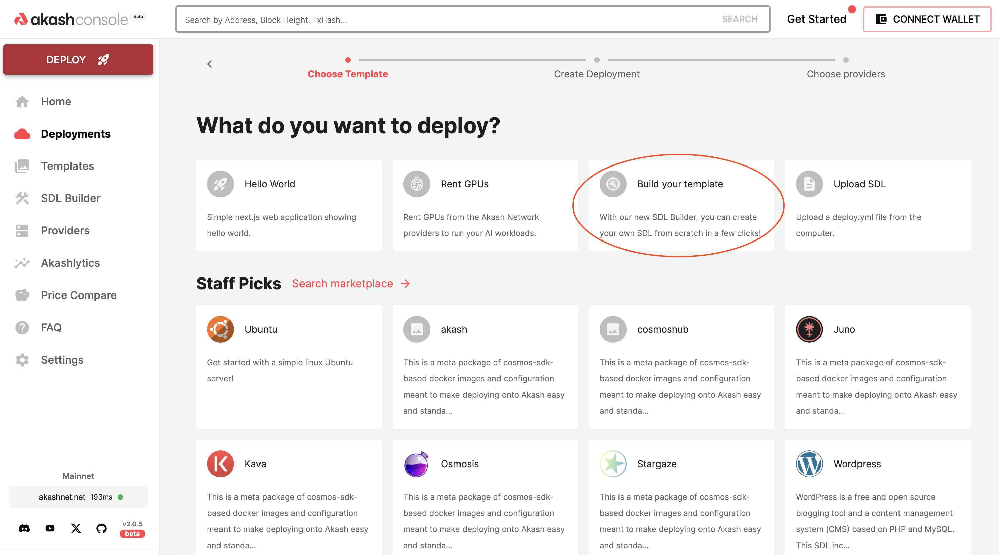
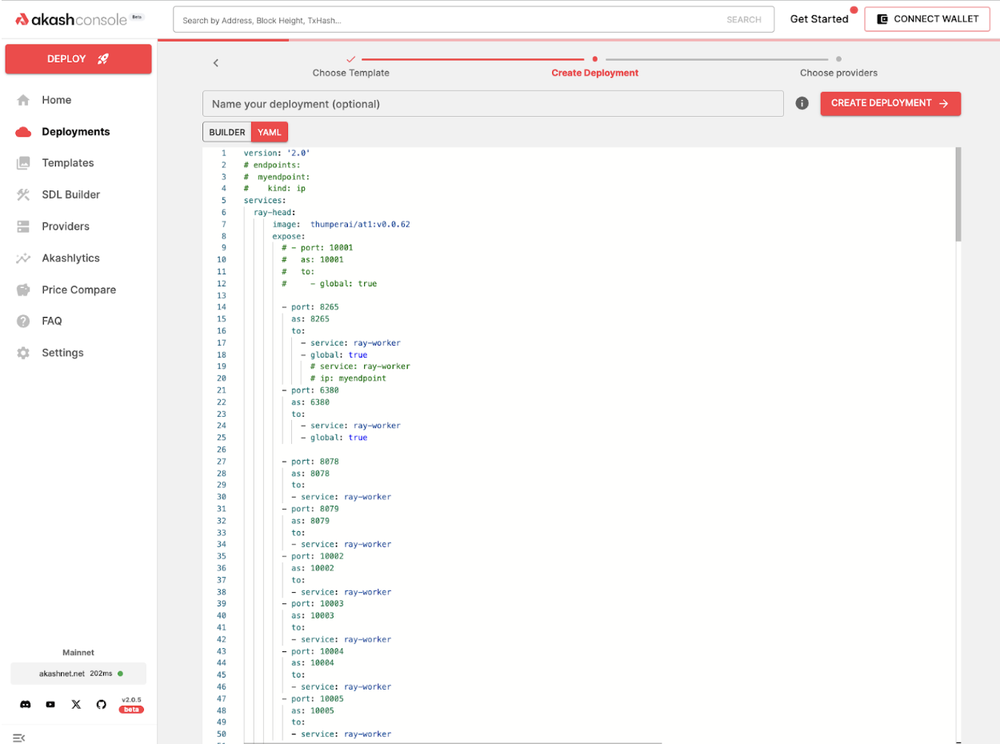

By Anil Murty and Logan Cerkovnik

In this post we provide an overview of the challenge of trying to parallelize and scale AI and ML workloads in practice, briefly introduce the best open source framework available and in-use by leading machine learning teams (Ray), talk about why Ray is a great solution for running ML workloads on Akash Network, and provide a reference example and template for those looking to run a Ray cluster on Akash Network’s GPU supercloud.

## Background

The proliferation of open source AI and ML models in the past year has enabled developers to build applications at a fairly rapid pace. This includes not just inference but even fine-tuning a model to adapt it to custom data sets and application needs and in some cases, even training a foundation model. Open source libraries from Pytorch, Tensorflow, Keras, Scikit-learn and others have allowed those without extensive experience in AI and ML, to relatively easily build Python based applications that leverage advanced AI capabilities. The challenge then shifts to being able to horizontally scale workloads to take advantage of a large number of computers, so as to be able to accelerate time to market and/ or run a service in production and scale it in response to user demand.

This concept of taking an ML workload that is built to run on a single GPU (server) and enabling it to run on a number of GPU servers (referred to as a “cluster”) is what is called “clustering” and “scaling”. The challenge of course is that, in order to do this, the application that was built to run on a single server needs to be parallelized to run on multiple machines. Doing this “natively” (by adding support for it directly in the application code) would require an advanced understanding of cloud infrastructure and parallel computing. This creates a technical barrier to being able to launch and scale such applications.

## Ray to save the day!

Ray is an open source framework that enables software developers not trained in distributed systems to easily leverage distributed computing. It does this by removing the burden of needing to natively parallelize a machine learning application, while enabling computations to scale out across a cluster of servers. This allows AI and ML developers to easily scale out their application or workload across a cluster of servers, without having to write additional code for that or needing to understand the details of the underlying infrastructure.

Some of the capabilities Ray offers include:

- **Automatic scaling:** In theory at least, a ray cluster creates the virtual abstraction of a single computer across a distributed cluster that can be very large.
- **Fault Tolerance:** By automatically rerouting tasks to other machines, when one or more nodes fail, Ray enables resilience that is crucial for long running AI training workloads and/ or production scale inference.
- **State Management:** With built in support for sharing and coordinating data across tasks and flexibility to use a variety of storage options - including in-memory (redis or equivalent) as well as cloud storage (S3 equivalent).

## Ray AI Runtime (AIR)

Ray’s ultimate goal is to provide a simple programmatic interface for developers to leverage distributed computing, so that you don’t have to be a distributed systems expert to be able to deploy, run, scale and manage your ML workload across a cluster of machines. The Ray AI Runtime (AIR) is the toolkit that implements this abstraction on top of the core Ray functionality.


The libraries made available as part of the AIR toolkit enable organizations to run the full gamut of ML workloads on distributed computing platforms like Akash Network.

- [Ray Serve](https://docs.ray.io/en/latest/serve/index.html): Framework-agnostic model serving library that can be used to build and deploy end-to-end distributed AI/ ML inference applications.
- [Ray Tune](https://docs.ray.io/en/latest/tune/index.html): Library for ML experiment execution and Hyperparameter Tuning.
- [Ray Train](https://docs.ray.io/en/latest/train/train.html): Scalable machine learning library for distributed training and fine-tuning.

## Typical Ray Workflow

The typical Ray based machine learning workflow may involve the following steps:

1. Build your AI/ML application (typically Python code)
2. Write a YAML file that will define your Ray cluster
3. Execute commands on the CLI to turn on/ off the cluster
4. Submit jobs and monitor them via the (web) dashboard



## Ray on Akash

Ray is fairly infrastructure agnostic and works with Docker containers - so it naturally lends itself to being a great solution to provide an abstraction of a “single server” on the [Akash Network decentralized cloud](https://akash.network/blog/building-the-open-cloud-part-2-re-imagining-the-cloud-with-akash/#akash-network-under-the-hood).

To enable users of Akash Network to easily utilize Ray’s capabilities, the ThumperAI team working with the Overclock Labs team has built a set of docker images and an [Akash SDL](https://docs.akash.network/readme/stack-definition-language) (Stack Definition Language) template that can be used as a reference for anyone wanting to run Ray clusters on Akash. The source code for this can be found on the [“awesome-akash](https://github.com/akash-network/awesome-akash” repository (contains an ever growing set of reference templates for running various common applications on Akash) at the following location:

[https://github.com/akash-network/awesome-akash/tree/master/ray](https://github.com/akash-network/awesome-akash/tree/master/ray)

The reference template is specifically optimized for GPU-based workloads and deploys a Ray cluster consisting of one [Head Node](https://docs.ray.io/en/latest/cluster/key-concepts.html#head-node) and six [Worker Nodes](https://docs.ray.io/en/latest/cluster/key-concepts.html#worker-node).

You can customize the reference to your specific workload needs in the following ways:

1. To update the version of Ray, Python or CUDA, update the Dockerfiles and replace the Ray Docker image used there, with one from here. The image used in the reference contains Python version 3.10, CUDA version 11.8.
   ```
   FROM  rayproject/ray-ml:nightly-py310-cu118
   EXPOSE 6380
   EXPOSE 8265
   RUN sudo apt-get install git-lfs s3fs -y
   RUN git lfs install --skip-repo
   RUN pip install s3fs
   COPY /starthead.sh .
   RUN sudo chmod 777 /home/ray/starthead.sh
   RUN sudo chmod a+x /home/ray/starthead.sh
   RUN sudo chown ray /home/ray/starthead.sh
   RUN sudo chmod 777 /home/ray
   # ENTRYPOINT ["bash -c"]
   CMD ["/home/ray/starthead.sh"]
   ```

Note that you will need to rebuild the docker images for the head node and the worker node and push them to a container registry, if you update the Dockerfiles. Follow the instructions in the [README](https://github.com/akash-network/awesome-akash/blob/master/ray/README.md) for that.

2. To update the number of worker nodes in your Ray cluster, modify the [deployment example file](https://github.com/akash-network/awesome-akash/blob/master/ray/deployment_example.yaml) (note that the reference deploys 6 Ray worker nodes).

   ```
   version: '2.0'
   services:
   ray-head:
       image: thumperai/rayakash:ray-head-gpu-py310
       expose:

           - port: 8265
           as: 8265
           to:
               - service: ray-worker, ray-worker1, ray-worker2, ray-worker3, ray-worker4, ray-worker5
               - global: true
           - port: 6380
           as: 6380
           to:
               - service: ray-worker, ray-worker1, ray-worker2, ray-worker3, ray-worker4,  ray-worker5
               - global: true

           - port: 8078
           as: 8078
           to:
               - service: ray-worker, ray-worker1, ray-worker2, ray-worker3, ray-worker4,  ray-worker5
           - port: 8079
           as: 8079
           to:
               - service: ray-worker, ray-worker1, ray-worker2, ray-worker3, ray-worker4,  ray-worker5
           - port: 10002
           as: 10002
           to:
               - service: ray-worker, ray-worker1, ray-worker2, ray-worker3, ray-worker4,  ray-worker5
           - port: 10003
           as: 10003
           to:
               - service: ray-worker, ray-worker1, ray-worker2, ray-worker3, ray-worker4, ray-worker5
           - port: 10004
           as: 10004
           to:
               - service: ray-worker, ray-worker1, ray-worker2, ray-worker3, ray-worker4, ray-worker5
           - port: 10005
           as: 10005
           to:
               - service: ray-worker, ray-worker1, ray-worker2, ray-worker3, ray-worker4,  ray-worker5
   ```

You will need to add various environment variables for your AWS access key and secret (if you are using S3 for storage), MinIO access key and secret (if using MinIO) and other things:

- `RAY_ADDRESS_HOST`: Specifies the address of the head node. Only edit if you are trying to use ray across multiple providers.
- `AWS_ACCESS_KEY_ID`, `AWS_SECRET_ACCESS_KEY`: Credentials for AWS services.
- `R2_BUCKET_URL`, `S3_ENDPOINT_URL`: URLs for S3-compatible storage services.
- `B2_APPLICATION_KEY_ID`, `B2_APPLICATION_KEY`: Credentials for Backblaze B2 storage.
- `MINIO_ACCESS_KEY`, `MINIO_SECRET_KEY`: Credentials for MinIO storage.
- `AWS_DEFAULT_REGION`: The default AWS region for services.
- `WANDB_API_KEY`, `WANDB_PROJECT`: Credentials and project name for Weights & Biases logging.

4. Update the resources needed for your specific workload, per worker, by modifying the service definition for `ray-head` and each `ray-worker` in the deployment example YAML file.

Once you have those things set up correctly, you can head over to [https://console.akash.network/](https://console.akash.network/) and use the template builder option to deploy your Ray cluster on Akash.





And here is a quick run through of what the whole end-to-end deployment workflow looks like:

<iframe width="100%" height="315" src="https://www.youtube.com/embed/pRsDy6rBY_A?si=b0xC1KHOZRNFPMho" title="YouTube video player" frameborder="0" allow="accelerometer; autoplay; clipboard-write; encrypted-media; gyroscope; picture-in-picture; web-share" allowfullscreen></iframe>

## Ray-on-Akash Case Study - Akash-Thumper-1 (AT-1)

ThumperAI and Overclock Labs (Creators of Akash Network) have been running a Ray cluster on a couple of Akash Providers for about 4 months now as part of [training a new AI foundation model](https://github.com/orgs/akash-network/discussions/300) called “Akash-Thumper”. We intend to release the first version of that model (called “AT-1”) on [Huggingface](https://huggingface.co/) soon.

Stay tuned for a set of blog posts in the coming weeks, which will delve into the details and results of the training process.

## Getting started with Ray on Akash

Do you use Ray for your inference, training, or fine-tuning workloads today? If so, the Akash core team would love to help you leverage Akash's GPU infrastructure for your needs — [reach out to the Akash core team to continue the conversation](https://akashnet.typeform.com/to/rhR4cWxQ).
